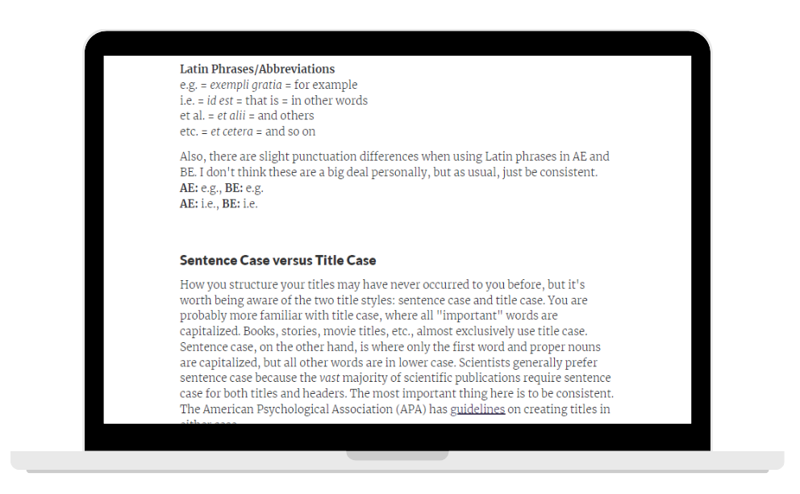

When I first arrived at DataCamp, there were no official writing guidelines. My previous job as a scientific editor was all about guidelines, so I thought this was pretty crazy. I wanted to promote consistency in the courses on our site, so I proposed creating guidelines. While I had the encouragement of my supervisor, I was not allotted dedicated time to the project, and my course development work remained the top priority. I'd never had any difficulty juggling my workload, so I set out on creating DataCamp's first writing guidelines.

## Process
I started this project by performing primary research: I collected qualitative data by looking through feedback that I'd sent to instructors over the previous months. Ideally, I would have also collected data from other CDs, but at that point most CDs provided feedback to instructors verbally in a 1:1 call. Beyond gathering data, I performed "desk research" to provide a reference for every guideline. This meant visiting several grammar sites, pulling out the most important information, and determining which site would be most appropriate as reference material.

I used a very loose thematic analysis to determine the structure of the guidelines—I jotted down the "theme" for the problems I was seeing (for example, acronyms, spelling, numbers, etc.), which became headings in the doc. I also added infographics, images, and videos to further demonstrate concepts and make things a bit more interesting. Once I'd drafted each section, I rearranged the sections to create more cohesion between the headings. I found creating the overall structure difficult since some topics were broad, "grammar is important", and some were specific, "how to work with subtitle rendering". I decided upon a "general to specific" structure to ensure the reader would start with the most relevant material. This approach got the guidelines into suitable enough shape to be a shareable MVP; however, if I were to redo this project today, I would use an open card sort (and other people) to create a more concise structure.

<figcaption class="caption"> A snippet from the MVP I created. This document included several calls to action to my teammates to help fill in the gaps in the guidelines.
</figcaption>

## Outcome
The initial response was not as enthusiastic as I had hoped. I shared the doc with my supervisor and my team, got a few comments like "that's great," but I never received any additional feedback or contributions to the doc. However, the effort was not in vain. About a year after writing my guidelines MVP, the Marketing team approached Content for help on creating domain-specific guidelines. I shared my guidelines (and my enthusiasm) with the lead for the project. Not long afterward, Waffles, DataCamp's design system was launched, and bits of my MVP appear throughout. Additionally, the Marketing team used these guidelines to drive a content audit of our site's course landing pages, so they've already had quite a large impact.

<figcaption class="caption"> Key elements of my MVP made it into "Waffles", including a statement about standardizing on American English along with a link to the same site I to demonstrate spelling differences between American and British English.
</figcaption>

<figcaption class="caption"> Key elements of my MVP made it into "Waffles," including a demonstration of how common Latin abbreviations are punctuated differently between standard American and British English.
</figcaption>

## Takeaways
This was my first side project at DataCamp and while the results had value, my solo approach was not the way to go. At the time I wrote the guidelines, I was the only person on the team with any previous editorial experience, and since it wasn't a high priority project, that seemed fine. However, 3/5 members of my team had been creating courses at DataCamp longer than me and were more aware of the pitfalls experienced by our instructors; considering their experience could have helped scope the project better. Additionally, if I had included them from the start, perhaps they would have been more enthusiastic about the idea itself. While there is much to be said about working independently, a little help never hurt anyone.