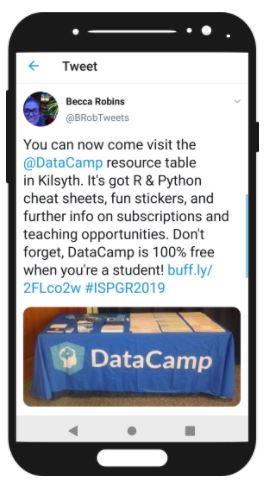
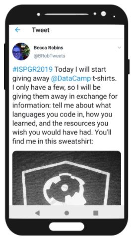
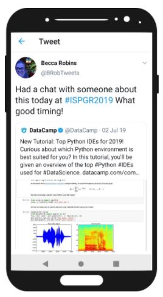
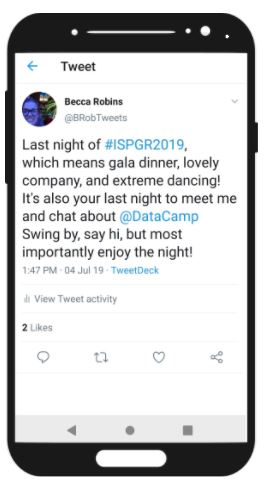

In January 2019, I was invited to give a talk at the International Society for Posture & Gait Research World Congress in Edinburgh, Scotland. The talk was part of a panel on transitioning into industry, which naturally led to introducing DataCamp as a skill-building tool. To supplement my talk, I stepped into the role of marketer/sales rep and embarked on a week-long Twitter campaign to support the DataCamp exhibition booth that I ran during the conference. These roles were definitely outside of my comfort zone and I really didn't know what I was getting into. My goals for the week were to spread awareness of DataCamp across the congress and to urge conference attendees, particularly students, to visit my booth, so that I could find out more about their needs and interests.

## Process

I started my campaign right after my talk finished. I made my slides available as soon as possible to ride the "motivation wave" at the beginning of a conference. My intention was to get as many members of "my audience" to look up and download my material. I also informed them where I would be (physically) available during the week along with some enticing freebies.

Once I had my booth set up, I made sure that people knew where they could find me and how a visit to my booth could benefit them. ​​​​​​​This particular tweet resulted in a very excited group of students who not only wanted the freebies but also wanted to find out more about this "100% free" thing they'd read. I explained everything to them, gave them my card, and heard back from them just a week after the conference!

I also quickly realized that I needed to use a social media management tool to set up my campaign. I carefully curated the content I promoted based on the conference attendee's skills and research methodology. Fortunately, I both knew this audience very well (it was my sixth time at this conference) and conference programs are really helpful guides to relevant topics.

After Day 1 of the conference, I found that my "stay at the booth and hope people show up" strategy wasn't going as well as expected, so I set up a new "mobile" strategy. 

Throughout the conference, I tried to add more personal tweets to the largely promotional tweets I was sending out. The main challenge here was keeping the tweets relevant while timely. I got lucky with the tweet shown here. I was having a conversation with an attendee about the various IDEs (integrated development environments) on the market and how it was difficult to determine which one to use and very time confusing to try them all yourself. It seemed as if our conversation summoned this tweet from @DataCamp. It allowed me to tweet about something entirely relevant and "shout out" to the person I spoke to as if to say "I got you covered!".

## Key takeaways
The main finding from running a Twitter campaign? It is HARD. Not only did I have to come up with a new way to say essentially the same thing multiple times a day, but I also had to time things perfectly while competing with all the other tweets at the conference. Given my familiarity with DataCamp's curriculum, the conference attendees, and the availability of the conference program ahead of the event, it would have been prudent to plan the entire campaign before the conference. This was definitely a teaching moment (many teaching moments, really) that I won't soon forget.

