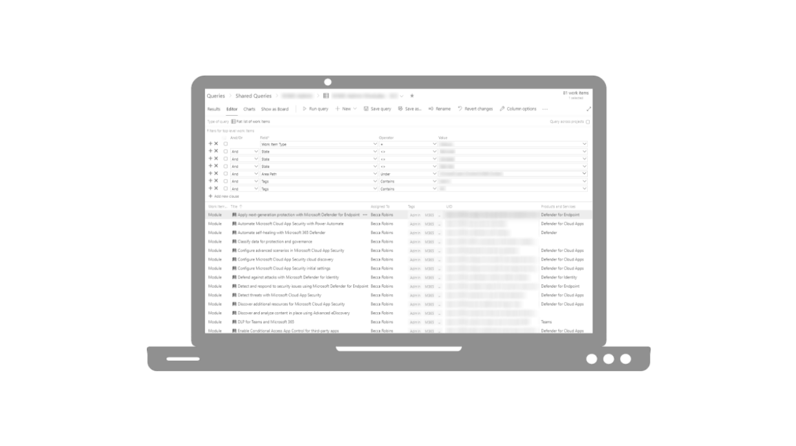

Like many new content platforms, scaling the content library was one of the main strategies employed by MS Learn. The M365 portfolio used vendors to create this content, which led to a huge content library after only two years and far exceeded the ability for internal staff to diligently maintain it. My team grew from 1 person to 3 people at the beginning of 2021 (I was #3) and as a former manager of content quality, I decided to check out this problem myself.

### Manual slog
While I had never used Azure DevOps prior to working at Microsoft, my experience with SQL and databases more generally, allowed me to get up to speed very quickly. Using these skills along with the information I knew about our content portfolio from our GitHub repo, I was able to query fairly quickly—but there was a catch. The work items in ADO didn't have all the information we needed. The work items for the entire library were mingled together while ownership was spread across three different departments. There wasn't a clear field in the ADO work item that reflected this reality, so I decided to use a tag to indicate ownership. I then spent a couple hours every day querying work items by their unique module IDs, tagging them with our team name, and triaging them. There were more than 13,000 work items and this took a few weeks. This resulted in ~250 valid work items that needed to be resolved by our team.

<figcaption class="caption"> TBD
</figcaption> 

### Vendor management
Since the backlog had been piling up for over two years, we needed additonal help, so our vendor writing team was brought on board. We worked together to create a "managed service". A lead vendor would assign work items to writers on their team who would then push this work to GitHub (where our content is hosted) and open a pull request (PR) for me and my colleague to review. This would ensure that the work items were appropriately addressed and the opportunity to course correct if necessary. We started this process in early September and by mid-November all tickets had been addressed.

### Moving to automation
To prevent future manual labor, I decided to take advantage of Microsoft's automation tool, Power Automate. With extensive previous experience with Zapier and a couple YouTube videos, I was up and running pretty quickly. After a few iterations, my team was receiving daily morning messages in Teams (see below) to notify them of new customer feedback. The message would tag the team member who "owned" the respective module along with a link to the respective work item. Now, instead of waiting months (or even years) to identify problems in our content, we were triaging our customer feedback within 48 hours of receiving it.

<figcaption class="caption"> TBD
</figcaption> 

## Key takeaways
Following the vendor-run maintenance program, a two-year backlog of tickets was resolved and closed—and the content performance scores for our team jumped from 60% to 89%. While the program achieved its goal, it was not without hurdles. The program included multiple vendors as well as internal employees who were quite new to the tools we were using (GitHub & ADO). I did not know this at the time and it led to many hours of troubleshooting merge conflicts and clarifying which tickets were closed and which were still in progress. If I were to start over again, I would have taken more time to clarify the exact scenarios we'd be using with each tool and provided resources for each of those.
Now that the backlog has been taken care of, the volume of new tickets is significantly less than it was and we've decided to move away from the more costly vendor-run program and use an internal one. Many of the same processes are in place, but we are still working through ways to keep things manageable for our staff writers while ensuring that our content is always bug-free.