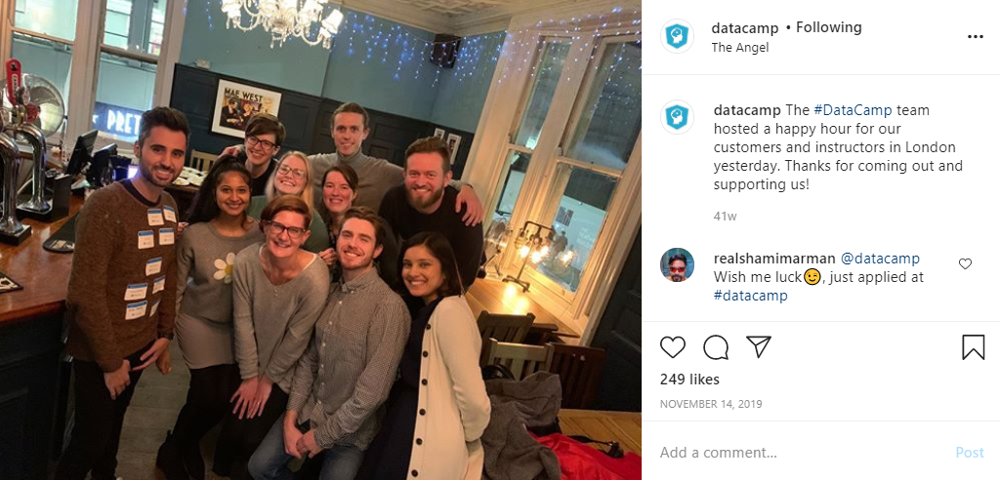

When I first started on the Content Team at DataCamp, there weren't many processes in place. This is pretty standard for fast-moving startups and wasn't a problem until we started to scale and enlist "repeat" instructors, i.e., subject matter experts who'd already made a course with us. This lack of process meant our repeat instructors wouldn't necessarily work with the same individuals they'd worked with before and they would often struggle to "onboard" to a new point of contact resulting in delays and discontent. As an individual contributor, I'd built my "own" process, which worked for me, but when I was promoted to Head of Content Development, I wanted to make sure that I took into consideration what the other Content Developers (CDs) were doing to build a process that tackled the aforementioned problems while making sure I had buy-in from my team.

## Process
### Survey
I started gathering data by surveying all CDs about their personal processes. I used a simple Google Form and focused on the amount of time people were spending on different parts of course development and the tools that were used. The results showed that there were discrepancies between team members in every stage of development.

<figcaption class="caption"> A survey about the CD process using Google Forms.
</figcaption> 

### Interviews
Since the survey revealed a general lack of consistency between CDs, I decided to interview each CD to dive a little bit deeper into how they approached the work and relationship management with instructors. While there were many differences between the individuals, a recurring theme was "spending too much time writing and rewriting the same information." A few individuals had created templates for themselves while others just bit the bullet and rewrote things or crossed their fingers that instructors remembered everything they'd discussed in their 1:1s.
Creating a communication workflow​​​​​​​
After reviewing the data, points in the development process that frequently required communication and clarification were identified. Seven "milestone" issues were written covering from the time the course is transitioned from the Curriculum Manager to the Content Developer (i.e., "handoff") to the hard launch of the course, when the course is marketed and the enters the "maintenance" phase. Canned messages were written using the heuristic "optimize for clarity over brevity".

## Creating a communication workflow

After reviewing the data, points in the development process that frequently required communication and clarification were identified. Seven "milestone" issues were written covering from the time the course is transitioned from the Curriculum Manager to the Content Developer (i.e., "handoff") to the hard launch of the course, when the course is marketed and the enters the "maintenance" phase. Canned messages were written using the heuristic "optimize for clarity over brevity".

<figcaption class="caption"> The initial set of instructor milestone issues spanned from scheduling the course handoff to informing instructors that their course had been hard launched by our Marketing team (and that their first paycheck was on its way).
</figcaption> 

### Personalization
Each canned message was saved as a text file and uploaded to a GitHub repository, whose contents could be downloaded locally. To personalize each canned message, the text files were pulled into a custom Python script that interfaced with the GitHub API through a Python wrapper called PyGitHub. Names, Calendly links, and due dates were updated using the script, and the message was then automatically and immediately sent from the CD's GitHub handle in a formatted and branded GitHub issue to the course instructor.

<figcaption class="caption"> The canned message sent to instructors at the Handoff stage. DataCamp courses are typically built with external instructors. Instructors need clarifying information about which stage of the process they're in, the purpose of the stage, and what they should be doing. Canned messages were used to provide this information and to ensure that each Content Developer provided the same information to each instructor.
</figcaption> 

## Outcome & Takeaway
The instructor communication workflow was quite successful; anecdotally, experienced CDs appreciated writing less. New CDs expressed their surprise at the level of organization of the Content team for a startup. Empirically, the duration of the development phase of course creation was reduced by ~15% following the workflow's launch. Additional messages have since been created by other DataCampers that extend this solution into both the design and maintenance phases of course creation. Overall, this workflow worked quite well. I would consider using a similar, if not identical, process in the future if faced with a similar problem.

<figcaption class="caption"> From DataCamp's Instragram: Another way we celebrate instructor achievements and gather feedback from our instructors is by hosting local events, such as this one that was held in London on November 13, 2019.
</figcaption> 
