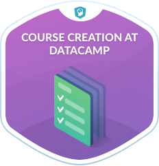

Instructor onboarding is a continual process when growing a learning platform. DataCamp has tried several methods: live training sessions, 1:1 training, and asynchronous online courses. However, the initial online course developed for instructor onboarding only covered the initial phase of course creation using an external tool that required internal onboarding, and further 1:1 training was usually needed in subsequent steps. To alleviate these issues and create a maintainable onboarding solution, the idea of "Course Creation at DataCamp" was born. Course Creation at DataCamp, or CC@DC as we affectionately called it, was designed and developed in-house using DataCamp's proprietary authoring tool, Teach, ensuring that future members of the Content Team would always have access to the course to make necessary updates.

### My role
For CC@DC, I worked as a Curriculum Manager, Content Developer, and Instructor alongside two other Content Developers. Additionally, each member of the Content team contributed by writing and recording a single lesson; my two CD colleagues and I rotated CD responsibilities for this content.

## Process​​​​​​​
Most DataCamp courses are created using a standard instructional design model called ADDIE, and CC@DC was no exception. While there are many other design models, some more suitable for in-house development, ADDIE was the right choice for two reasons: 1) competing projects and 2) familiarity. The ADDIE model works particularly well when scaling a course library; you can work on the content in phases (rather than sprints) and easily build multiple courses at once. Furthermore, since the team already used this model, and we wanted to get to work quickly, it made sense to focus on the content rather than the workflow.

### Analyze
The Analyze phase of ADDIE consists of a needs analysis; in other words, "What is the actual problem?" In addition to a content audit of the existing training content, my team and I spoke with each other and Content Team members about the issues they discussed most with their instructors. Furthermore, we spoke with other stakeholders, e.g., PM, Engineering Leads, etc. to determine the scope of the technical information that should be included in the training.

<figcaption class="caption">The introductory video exercise of "Course Creation at DataCamp".  A sample of videos from DataCamp courses are available on YouTube for free; access to all DataCamp content requires a premium subscription.
</figcaption> 

### Design
As outlined in the corresponding video, the Design phase of ADDIE consists of building the course blueprint. The two other Content Developers and I took the analysis phase results and created a blueprint, or course specifications, that outlined the required information (through learning objectives) in a logical order where each new concept built on the previous one. We iterated on these specs several times before landing on the final version.

<figcaption class="caption">The second video exercise of "Course Creation at DataCamp".  A sample of videos from DataCamp courses are available on YouTube for free; access to all DataCamp content requires a premium subscription.
</figcaption> 

### Develop
To utilize the team's talent and work swiftly, the Development of some lessons was "outsourced" to members of the Content Team. The core team took on 2-3 lessons each, which included writing a video script of ~400-600 words, the associated slide deck, and 2-4 interactive exercises, consisting of either multiple choice exercises or coding exercises, and their submission correctness tests (see: Developing a data science curriculum).

<figcaption class="caption">The third video exercise of "Course Creation at DataCamp".  A sample of videos from DataCamp courses are available on YouTube for free; access to all DataCamp content requires a premium subscription.
</figcaption> 

### Implement
DataCamp uses a proprietary authoring tool called Teach, which makes authoring code content very simple. Since Teach is proprietary, there are no licensing issues, so Implementation of all DataCamp course content happens concurrently with development (as long as the instructor has been onboarded, of course!) Following implementation, each lesson was reviewed and edited directly within the authoring tool. Each lesson underwent two rounds of review, each by a separate Content Developer. Lastly, the course was reviewed in its entirety, and QA'd to test each exercise thoroughly.

<figcaption class="caption"> Course Creation at DataCamp's course badge, courtesy of DataCamp's Design Team.
</figcaption> 

### Evaluate
Typically, courses follow a standard Evaluation procedure: the course is soft-launched; standard KPIs are used to evaluate course quality, adjustments are made, and then the course is hard-launched and marketed. While CC@DC was never intended for an actual marketing campaign, it did follow standard evaluation procedures. It was tested by instructors for ~1 month before hard launch. DataCamp uses a custom internal dashboard for evaluation and standard edTech KPIs, such as course completions, completion rates, course ratings, individual exercise metrics, and qualitative student feedback are used to make informed, data-driven improvements to live content. This dashboard is reviewed regularly, and evaluation happens as long as the course is live on the site.

## Outcome
Generally, the response to CC@DC has been positive, and the course's rating typically hovers between 4.6-4.7 (on a 5-point scale). Following its launch, course development time decreased by ~20%, which was an excellent outcome. Furthermore, it's been almost two years since its launch, and it is still the standard onboarding practice for instructors at DataCamp.

## Takeaway
While the outcome of the training program was desirable, the process was a bit chaotic at times. The decision to include the entire content team was not only to use everyone's collective knowledge but also to support inclusion and foster camaraderie. However, this came at a severe cost in managing the project. Wrangling ~20 individuals and imposing tight deadlines was challenging. While the project did bring the team together (we even had a launch party), it also brought on several headaches. If I were to start over, I would work with a team of maybe five extremely-dedicated (and available) members at most to design and develop the training program from start to finish.