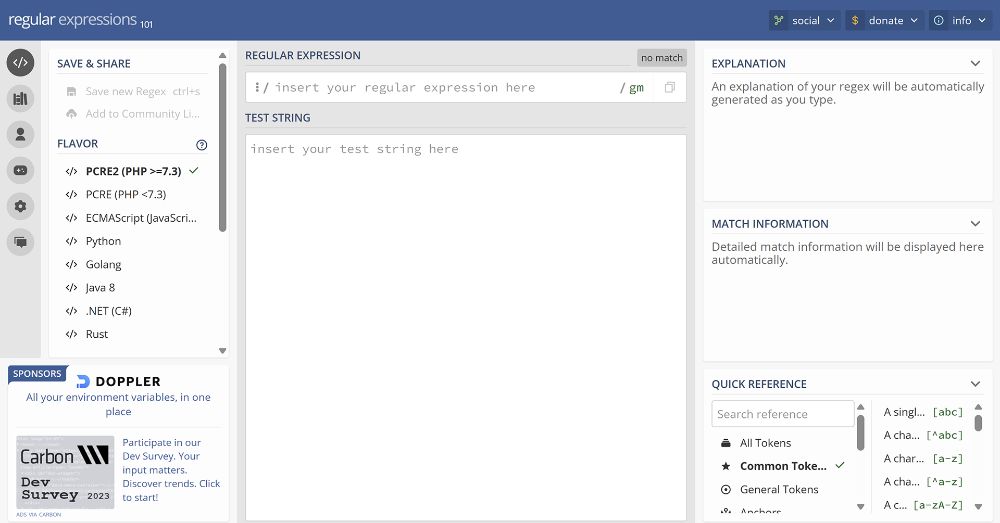

This project was actually pretty straightforward but also pushed some limits (for me at least). Essentially, content on learn.microsoft.com is written/rendered using a combination of Markdown and YAML files. We often work with partners who aren't familiar with the syntax of these files, so we need to port them over to a Word doc for them to review and edit. Doing this manually can be time-consuming, sometimes even up to an hour. While requests for Word docs weren't a daily thing, it was frequent enough that we needed another solution.

<figcaption class="caption">
Left: Markdown version of a training module. Right: Word version of a training module.
</figcaption>

## Process
### Regex to the rescue
Since I started working in content at a data science education company, I've gotten very familiar with text mining. For me, this means using Python along with regular expressions, or regex. Regex uses specific sets of characters to match patterns within a body of text. Finding the correct set of characters is really the trick, and I'm no wizard at regex, so I'm very reliant on handy tools to help build these. For this project and all the text mining I've done lately, I've been using https://regex101.com, which provides a sandbox for testing along with a reference guide and an area where you can confirm your regex matches. Finding the correct patterns for all the elements in our training modules (images, videos, code blocks, etc.) was a lot of trial and error; making sure that I captured the right patterns and every instance of those patterns.

<figcaption class="caption">
Screenshot of regex101.com, a helpful tool that I use all the time.
</figcaption>

### Helpful Python packages
The next challenge was mapping Markdown to Word syntax. For this, I found the python-docx library to be a lifesaver. The sole purpose of this library is to create and update Word documents, so again, it was a matter of trial and error as I worked my way through the different Markdown syntax and found the matching Word syntax. Once I had a working script in a Jupyter notebook, I returned to another recent (at that time) discovery of the PySimpleGUI library, and I turned the script into an app so that my colleagues could benefit and not need me to run the script for them. The last step was updating the app so that it could either grab the live version of the training module or an in-development version, which is a common use case before a module is launched.

<figcaption class="caption">
The final (simple) GUI for the "Create Word Doc from Markdown" app.
</figcaption>

## Key takeaways
I wish I would have done this sooner! This was only a few days of work and I learned a lot and ultimately brought down a task that was taking anywhere between 30 and 60 minutes to around 5 seconds. Not only did it shorten the task by approximately 99%, but packaging it into an app meant that I could share it with my non-programming co-workers. In fact, I did just that and was able to iterate and improve upon the app immediately using their feedback. I hope to take this project a step further and convert it into a Visual Studio Code extension that can be used Microsoft-wide.