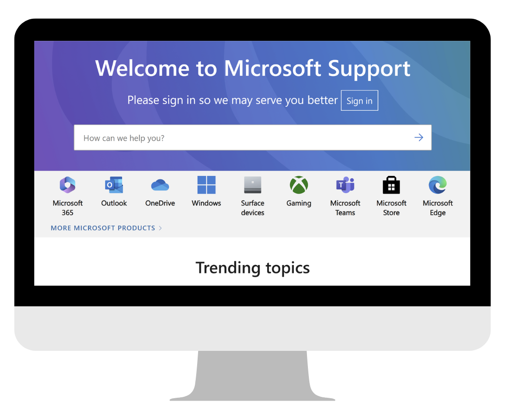
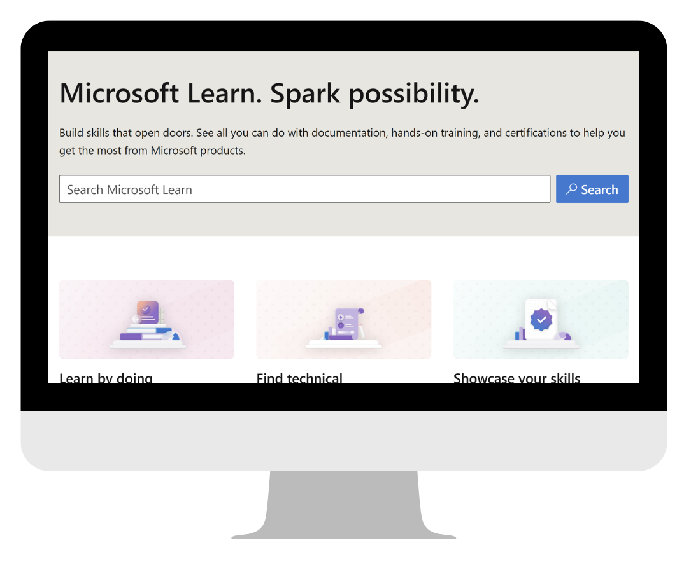
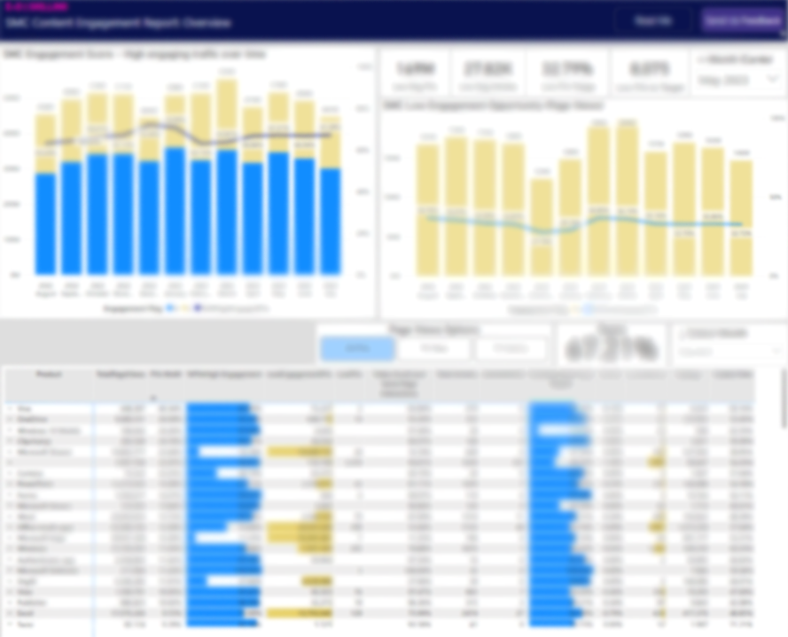
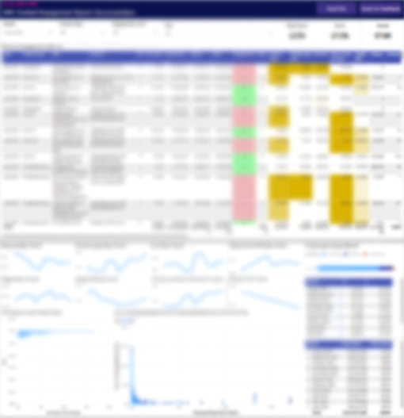

Following a reorg, my team found itself in charge of two separate content platforms: learn.microsoft.com (LMC) and support.microsoft.com (SMC). While these two platforms had a lot in common, data and reporting were vastly different. Importantly, on LMC, we'd been measuring "content engagement" using a set of core behavioral metrics that quantified user behavior in relation to page view data. These metrics brought (and still bring) valuable insights that help inform content strategy. However, on SMC, most of these metrics were not measured at all.

<figcaption class="caption">
The landing pages for learn.microsoft.com and support.microsoft.com.
</figcaption>

### Communication was the key
Getting this data in place was of the utmost importance following the reorg. The ability to have cohesive communication about data ("apples-to-apples" is the term that was thrown around a lot), was crucial to the successful transition of this new org. Furthermore, higher-ups were demanding consistency in reporting metrics; a single metric to "rule them all". This concept and the associated plan for this dashboard had been discussed, researched, and changed hands multiple times before I joined the project, so my first step when I was brought on as the Product Manager was to solidify as much prior knowledge as I could.
I gathered the available documentation: a couple of email threads, a 2-page project frame document, and a single screenshot of a Teams chat. This was not much to go on, so I scheduled 1:1s with all the relevant parties and asked them what they knew and what they believed about the project-unsurprisingly, not everyone was on the same page. Following a few weeks of back-and-forth, we landed on a project goal: establish a baseline for SMC that achieves parity (to the degree possible) with LMC. Out of scope was creating a new and improved framework for the project, which was difficult for a lot of people because the original framework left a lot to be desired.

<figcaption class="caption">
The "Overview" page shows general trends for selected content sets. Data is blurred as it is internal Microsoft data.
</figcaption>

Once we knew what was clearly in scope and what was out of scope, we got to work. I worked closely with a Data Engineer, who pulled together the necessary data pipelines and built the Power BI dashboard, and a Data Scientist, who analyzed the available data to create "thresholds" for our core metrics. These thresholds would serve as the litmus test for whether or not a piece of content was meeting customer needs. I continued to document our progress, as well as meet with core stakeholders to learn about and discuss various dependencies. These conversations were not without the occasional setback (some real, some imagined), but we managed to launch the dashboard in ~3 months. It still has some bugs, but fortunately, we still have individuals dedicated to the project and have been able to continue iterating and improving on our work.

 

<figcaption class="caption">
Left: The "Documentation" tab shows metrics for individual articles.
Right: The "Low Traffic" tab lists articles with too little traffic to generate reliable figures for core metrics.
</figcaption>

## Key takeaways
While I don't love that this project was launched agree with the HiPPO (highest paid person's opinion) approach, it's brought a rich set of data to my team that otherwise would not exist and it has helped illuminate issues in our content other than just engagement issues. Overall, I'm happy with the end result, which is a launched dashboard, a clear Agile framework for further iterations, and engaged users. As I continue with this project, I'm learning more about my users and that some are a bit more weary about data. To this end, I've started using the data available in the dashboard to build customized reports that present the data in a contextualized way and also provide a bit more explanation on how to read and interpret specific types of charts and graphs.