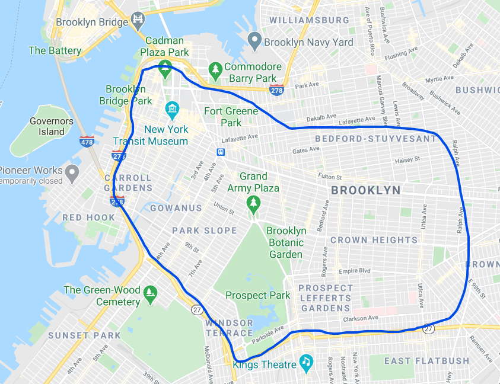

During the COVID-19 pandemic, I, like most of the world, found myself at home A LOT. I was incredibly lucky and maintained both my health and my employment, but seeing the stories from around my city, I knew I needed to help those less fortunate. I signed up for New York Cares, the largest volunteer network in New York City.

Once I was an official volunteer, I registered for a project in nearby Park Slope. The tasks required by me as a volunteer were relatively simple: 1) show up on time, 2) get bags of food to deliver, 3) delivery said bags of food. It was easy and it got me outside and exercising.

<figcaption class="caption"> Volunteers for "my" New York Cares project deliver meals to home-bound individuals by walking, biking, or driving to their location. The project involves both communication and logistical challenges.
</figcaption>

About two months into the project, a call to action was put about by New York Cares that the project was looking for a new Team Leader and I heeded the call.

## Volunteering is a service experience
Since becoming a team leader for this project, I’ve found that my main responsibilities are three-fold:
1. Delivering the right information to volunteers at the right time.
2. Delivering all items on the day of the project.
3. Getting volunteers to re-register for future projects.

The second task is largely a logistical problem; this must be solved on-site due to variance in the number of deliveries and the number of volunteers that show up that day. However, tasks #1 and #3 are dependent on clear communication and good experience design. To tackle these problems, I created a reusable communication workflow that conveys all the necessary information clearly and keeps volunteers engaged.

<figcaption class="caption"> TBD
</figcaption>

## Key takeaways
While I'm still iterating over this design (and will continue to do so as along as I'm on the project), it has been substantially more complicated than I anticipated. New York Cares is a volunteer network that partners with organizations in the community, who in turn, serve the community. Furthermore, the individuals who directly serve the community alongside the partnership organizations do not work for New York Cares. This structure benefits both New York Cares and their partner organizations, but it does make designing a user experience as a Team Leader challenging. There are restrictions in-place that prevent any type of formal user experience research, so my design is built on a combination of onsite inquiry, questions/feedback via New York Care's messaging service, and my personal experience as a volunteer.